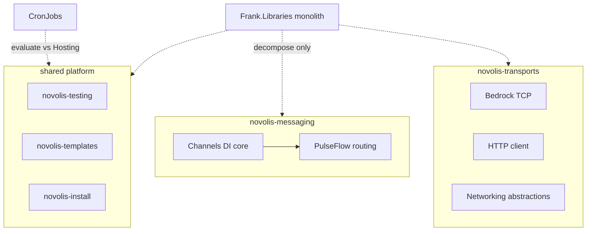
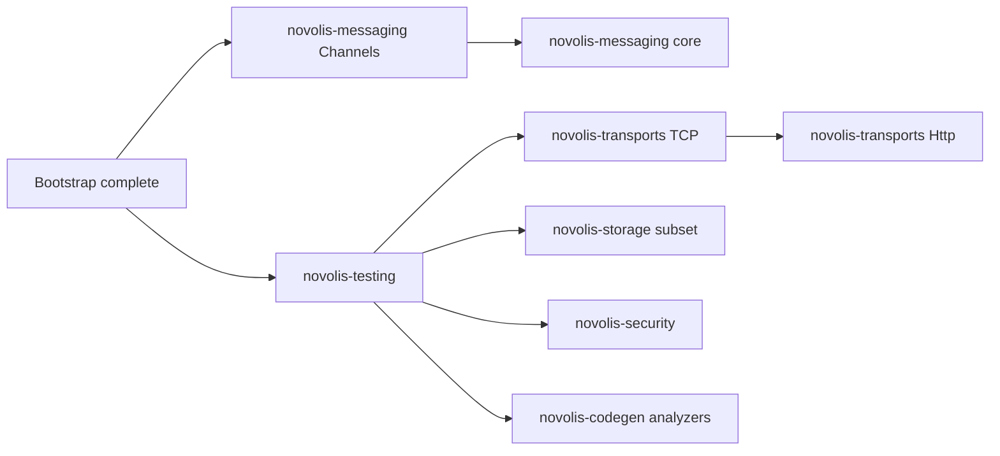

# Frank.* → Novolis library extraction: evaluation plan

## Context and constraints

[Novolis-Platform](https://github.com/Novolis-Platform) already reserves domain repos and forbids migration until bootstrap completes ([`plans/bootstrapping-organization.md`](plans/bootstrapping-organization.md) §20: *“No real library migration has started”*).

**Your choices (locked in for this plan):**

- **Game:** [novolis-raylib](https://github.com/Novolis-Platform/novolis-raylib) first; [Frank.GameEngine](https://github.com/frankhaugen/Frank.GameEngine) is reference/archive unless a narrow, non-overlapping slice is identified.
- **Style:** **Extract/rebuild** into `novolis-*` repos per [`migration-checklist`](plans/bootstrapping-organization.md) §16—no default history transfer; normalize namespaces to `Novolis.*` and repos to `novolis-<domain>`.

**Naming targets** (from governance draft):

| Source pattern | Novolis repo | NuGet prefix |
|----------------|--------------|--------------|
| Frank.X | `novolis-<domain>` | `Novolis.<Domain>` |
| Frank.X.Y | same repo, sub-package | `Novolis.<Domain>.<Facet>` |

Reserved slots today (from org API): `novolis-messaging`, `novolis-transports`, `novolis-security`, `novolis-storage`, `novolis-testing`, `novolis-templates`, `novolis-analyzers`, `novolis-codegen`, `novolis-machinelearning`, `novolis-raylib`, plus `novolis-math`, `novolis-physics`, `novolis-install`, etc.

---

## Phase A — “Plan to make a plan” (evaluation program)

### A1. Gate: bootstrap completion

Do **not** copy Frank code until [bootstrapping-organization.md](plans/bootstrapping-organization.md) completion criteria are met (governance, template, workflows, registry, smoketest, trusted NuGet publish validated).

**Deliverable:** `novolis-governance/docs/migration-checklist.md` (formalize §16) + `novolis-governance/docs/frank-inventory.md` (new).

### A2. Evaluation rubric (score each repo 0–5 per column)

| Dimension | Question |
|-----------|----------|
| **Strategic fit** | Does it advance Novolis story (modular .NET infra, realtime, graphics adjacency)? |
| **Differentiation** | Better than using BCL + mainstream packages alone? |
| **Maturity** | Tests, CI, releases, docs, active commits, clear API surface? |
| **Novolis home** | Maps cleanly to an existing reserved repo (no new junk-drawer)? |
| **Overlap risk** | Duplicates another Frank repo or planned Novolis package? |
| **Maintenance cost** | Estimated ongoing burden (S/M/L/XL) after extraction |

**Decision bands** (sum of Strategic + Differentiation + Maturity, max 15):

| Band | Score | Action |
|------|-------|--------|
| **Bring (P0)** | 12–15 | Schedule extraction wave; define target packages |
| **Evaluate (P1)** | 8–11 | Spike: read code, list packages to keep/drop, then re-score |
| **Reference (P2)** | 4–7 | Keep Frank repo; mine ideas/tests only; README pointer |
| **Skip (P3)** | 0–3 | Do not migrate; archive Frank repo when convenient |

**Extraction modes** (per repo, recorded in inventory):

- **Extract** — copy selected projects/files into `novolis-*`
- **Merge** — fold into an existing Novolis package (e.g. tiny helper into messaging core)
- **Rebuild** — reimplement API against Novolis standards (preferred when tests are weak)
- **Archive** — no Novolis code; link from old README

### A3. Per-repo inventory workflow (repeatable checklist)

For each Frank repo (1–2 hours each for P0/P1):

1. Clone; list solution projects and published NuGet IDs (`*.csproj` `PackageId`).
2. Map dependency graph (especially Frank→Frank edges).
3. Record: target TFM (`global.json`), test count/coverage gut-check, last release date, open issues.
4. Identify **minimum viable slice** (one package users would actually install).
5. Draft **Novolis package list** + breaking API changes from rename.
6. Log **blockers** (GPL deps, secrets, AI-generated dead code, missing tests).
7. Assign P0–P3 and extraction mode; open tracking issue on target `novolis-*` repo (`status:reserved` → `status:bootstrap`).

### A4. Cross-repo consolidation map (avoid duplicate Novolis domains)



### A5. Evaluation deliverables (end of Phase A)

| Deliverable | Location |
|-------------|----------|
| Master inventory table (all 21 repos) | `novolis-governance/docs/frank-inventory.md` |
| P0 extraction briefs (1 page each) | Issues on target `novolis-*` repos |
| Dependency/order diagram | Same doc + linked from roadmap |
| Explicit **non-goals** list | Prevents scope creep (WPF, IRC learning repos, etc.) |
| Pilot candidate | Smallest P0 with fewest Frank-internal deps |

**Suggested pilot:** [Frank.Channels.DependencyInjection](https://github.com/frankhaugen/Frank.Channels.DependencyInjection) → slice into `novolis-messaging` as `Novolis.Messaging.Channels` (or core package), because [Frank.PulseFlow](https://github.com/frankhaugen/Frank.PulseFlow) depends on it and the surface area is tiny (~net10, well-scoped).

---

## Phase B — Output of evaluation: per-domain extraction plans (not execution yet)

After Phase A, produce **one extraction plan per P0 domain** using this template:

```markdown
## novolis-<domain> extraction plan
- Source repos: ...
- Packages in scope: ...
- Out of scope: ...
- Frank→Novolis namespace map: ...
- Test migration strategy: ...
- Release: 0.1.0-preview criteria
- Frank repo sunset: archive + README banner
```

Wave order (recommended, respects dependencies and bootstrap):

| Wave | Novolis repo | Frank sources | Rationale |
|------|--------------|---------------|-----------|
| 0 | `novolis-messaging` | Channels.DI, then PulseFlow | PulseFlow depends on Channels; defines messaging story |
| 1 | `novolis-testing` | Frank.Testing | Unblocks quality bar for all later waves |
| 2 | `novolis-transports` | BedrockSlim, Http (+ Networking audit) | Core infra; Bedrock is cohesive |
| 3 | `novolis-storage` | DataStorage (subset) | Pick 1–2 backends first (Json + Sqlite), not full matrix |
| 4 | `novolis-security` | Frank.Security (Cryptography + HIBP client) | Aligns with reserved repo |
| 5 | `novolis-analyzers` / `novolis-codegen` | Analyzers + Reflection generators | Split analyzers vs source generators per governance |
| 6 | `novolis-templates` | Frank.Templates | Merge with existing template repo policy |
| 7 | `novolis-install` | SimpleInstaller ideas only | **Rebuild** against `novolis-install` CLI—do not copy UX wholesale |
| Late | `novolis-machinelearning` | Frank.ML (private) | Only after public API review |
| Deferred | — | GameEngine, IRC, CrossPlatformWindow, Wpf, Markdown, Collections, CronJobs, Networking monolith | See inventory table |

**Raylib / game:** Continue [plans/raylib-package-ecosystem.md](plans/raylib-package-ecosystem.md). Mine GameEngine only for **non-rendering** ideas (e.g. physics abstractions) into `novolis-physics` if evaluation proves they are renderer-agnostic—never migrate `Frank.GameEngine.Rendering.*` while `Novolis.Raylib` is the graphics path.

---

## Master inventory table (initial assessment — to validate in Phase A)

Scores are **provisional** (desktop review + public metadata); Phase A must confirm by reading code and CI.

### Tier P0 — Bring (extract into reserved Novolis repos)

| Frank repo | Provisional score | Novolis target | Packages / slice | Mode | Notes |
|------------|-------------------|----------------|------------------|------|-------|
| [Frank.Channels.DependencyInjection](https://github.com/frankhaugen/Frank.Channels.DependencyInjection) | 14 | `novolis-messaging` | `Novolis.Messaging.Channels` | Extract | Small, net10, DI-native; PulseFlow dependency |
| [Frank.PulseFlow](https://github.com/frankhaugen/Frank.PulseFlow) | 13 | `novolis-messaging` | `Novolis.Messaging` (+ docs) | Extract | 73 commits, docs/, fits `novolis-messaging` name |
| [Frank.BedrockSlim](https://github.com/frankhaugen/Frank.BedrockSlim) | 12 | `novolis-transports` | `Novolis.Transports.Tcp` Server/Client | Extract | Clear Bedrock TCP story; samples exist |
| [Frank.Testing](https://github.com/frankhaugen/Frank.Testing) | 12 | `novolis-testing` | `Novolis.Testing.Xunit` (+ facets) | Extract | Direct slot; improves all later migrations |
| [Frank.DataStorage](https://github.com/frankhaugen/Frank.DataStorage) | 11 | `novolis-storage` | Start: `Novolis.Storage.Json`, `.Sqlite` | Extract subset | Many backends—do not migrate all at once |
| [Frank.Http](https://github.com/frankhaugen/Frank.Http) | 11 | `novolis-transports` | `Novolis.Transports.Http` | Extract | REST client; releases exist |
| [Frank.Security](https://github.com/frankhaugen/Frank.Security) | 10 | `novolis-security` | Crypto + HaveIBeenPwned packages | Extract | Sparse docs but clear domain slot |

### Tier P1 — Evaluate (spike before committing)

| Frank repo | Score | Novolis target | Recommendation | Risk |
|------------|-------|----------------|----------------|------|
| [Frank.CronJobs](https://github.com/frankhaugen/Frank.CronJobs) | 10 | New or `novolis-hosting`? | Extract if DI cron + `IScheduleMaintainer` still beats CronQuery + hosted services | API overlap with ecosystem |
| [Frank.Reflection](https://github.com/frankhaugen/Frank.Reflection) | 10 | `novolis-codegen` | Bring Dump/Mermaid/Roslyn **selectively** | Large surface; overlaps tooling |
| [Frank.Analyzers](https://github.com/frankhaugen/Frank.Analyzers) | 9 | `novolis-analyzers` + `novolis-codegen` | Split analyzers vs source generators | C/C++ interop gen may be out of scope |
| [Frank.Templates](https://github.com/frankhaugen/Frank.Templates) | 9 | `novolis-templates` | Merge templates into org template policy | Must not conflict with `novolis-template-dotnet` |
| [Frank.Markdown](https://github.com/frankhaugen/Frank.Markdown) | 8 | TBD (`novolis-docs`?) | P1 only if Novolis wants doc-generation brand | No reserved repo yet—needs governance decision |
| [Frank.Networking](https://github.com/frankhaugen/Frank.Networking) | 8 | `novolis-transports` | Audit vs Bedrock/Http; likely **partial** extract | Ambitious README; no releases |
| [Frank.Collections](https://github.com/frankhaugen/Frank.Collections) | 8 | `novolis-math` or small package | `Array2D` / observables if still used | Niche; check usage in other Frank repos |
| [Frank.ML](https://github.com/frankhaugen/Frank.ML) | ? | `novolis-machinelearning` | **Private** learning repo—evaluate for public API only | Not visible externally; likely P2/P3 |

### Tier P2 — Reference / archive (do not bulk migrate)

| Frank repo | Score | Treatment |
|------------|-------|-----------|
| [Frank.GameEngine](https://github.com/frankhaugen/Frank.GameEngine) | 9 fit / **high overlap** | **Reference only** per your choice; mine docs for `novolis-physics` if renderer-agnostic |
| [Frank.Libraries](https://github.com/frankhaugen/Frank.Libraries) | 8 | **Decompose inventory only**—author warned not production-ready; treat as parts catalog |
| [Frank.SimpleInstaller](https://github.com/frankhaugen/Frank.SimpleInstaller) | 7 | Ideas for `novolis-install`; **rebuild**, don’t extract |
| [Frank.IRC](https://github.com/frankhaugen/Frank.IRC) | 6 | Learning project; skip unless transports needs IRC |
| [Frank.CrossPlatformWindow](https://github.com/frankhaugen/Frank.CrossPlatformWindow) | 6 | SDL2 window—only if Novolis goes native-window path outside Raylib |
| [Frank.Libraries.Wpf](https://github.com/frankhaugen/Frank.Libraries.Wpf) | 5 | WPF controls—off-brand unless Novolis adds desktop UI lane |

### Tier P3 — Skip

| Frank repo | Reason |
|------------|--------|
| Frank.IRC (if no transport need) | Educational, duplicate of Networking.Irc |
| Frank.ML (likely) | Private learning sandbox unless promoted deliberately |
| Duplicate/overlapping experiments | After P1 spikes, drop losers explicitly |

---

## Frank → Novolis package mapping (draft)

| Frank NuGet / project | Proposed Novolis ID | Target repo |
|----------------------|---------------------|-------------|
| `Frank.Channels.DependencyInjection` | `Novolis.Messaging.Channels` | `novolis-messaging` |
| `Frank.PulseFlow` | `Novolis.Messaging` | `novolis-messaging` |
| `Frank.BedrockSlim.Server` / `.Client` | `Novolis.Transports.Tcp.Server` / `.Client` | `novolis-transports` |
| `Frank.Http` | `Novolis.Transports.Http` | `novolis-transports` |
| `Frank.Testing.*` | `Novolis.Testing.*` | `novolis-testing` |
| `Frank.DataStorage.*` | `Novolis.Storage.*` | `novolis-storage` |
| `Frank.Security.*` | `Novolis.Security.*` | `novolis-security` |
| `Frank.CronJobs` | `Novolis.Scheduling` or hosting extension | TBD in P1 spike |
| `Frank.Reflection` / generators | `Novolis.CodeGen.*` / `Novolis.Analyzers.*` | split repos |
| `Frank.Templates` | Template packages under `novolis-templates` | policy merge |
| `Frank.GameEngine.*` | **No default mapping** | reference → `novolis-physics` ideas only |
| `Frank.Libraries.*` | Case-by-case after audit | multiple |

---

## Dependency-aware extraction order



---

## Phase A timeline (suggested)

| Week | Activity |
|------|----------|
| 1 | Finish bootstrap gate; create `frank-inventory.md` + rubric |
| 2 | Deep-dive P0 repos (7 repos); confirm scores; write Wave 0–2 briefs |
| 3 | P1 spikes (CronJobs, Reflection, Analyzers, Templates, Networking, Collections, ML) |
| 4 | Consolidation workshop: finalize waves, non-goals, pilot extraction plan for Channels |

---

## Success criteria for “evaluation plan complete”

- Every listed Frank repo has a row in `frank-inventory.md` with scores, P0–P3, mode, and owner.
- Each P0 repo has a linked GitHub issue on the target `novolis-*` repo with package list and out-of-scope boundaries.
- GameEngine explicitly marked **reference-only** with rules for what may feed `novolis-physics` / `novolis-raylib`.
- Pilot repo (`Channels.DI`) has a written extraction plan ready for implementation **after** bootstrap + template CI green.
- Roadmap in `novolis-governance` updated with waves 0–n dates (no code moved yet).

---

## Immediate next actions (when you approve this plan)

1. Add `novolis-governance/docs/frank-inventory.md` using the master table above as seed data.
2. Run Phase A3 checklist on **Frank.Channels.DependencyInjection** and **Frank.PulseFlow** first (messaging chain).
3. Do **not** touch Frank.GameEngine except to tag non-rendering modules in an inventory issue for `novolis-physics`.
4. Keep [Frank.ML](https://github.com/frankhaugen/Frank.ML) evaluation internal until you decide to publish `novolis-machinelearning`.
