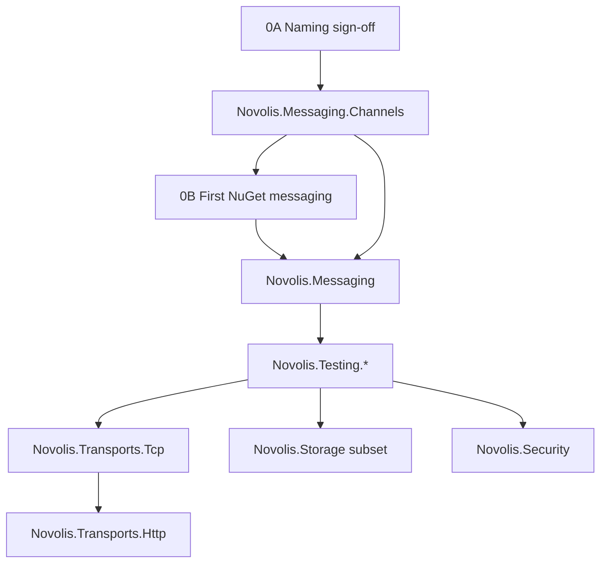

# Frank.* → Novolis migration execution plan

## What exists today

**Governance (evaluation done):**

- [frank-inventory.md](D:/novolis/novolis-governance/docs/frank-inventory.md) — tiers, package map, waves, tracking issues
- [migration-checklist.md](D:/novolis/novolis-governance/docs/migration-checklist.md) — per-repo steps
- [bootstrap-gate-assessment.md](D:/novolis/novolis-governance/docs/bootstrap-gate-assessment.md) — org bootstrap vs migration gate (needs split; see below)
- Extraction briefs under `docs/extraction-briefs/`
- [naming.md](D:/novolis/novolis-governance/docs/naming.md) — high-level rules only (not enough for migration)

**Target repos (`D:\novolis\`):** reserved scaffolds — no `src/` yet. Example: [novolis-messaging/.novolis/packages.json](D:/novolis/novolis-messaging/.novolis/packages.json) assumes a single `Novolis.Messaging` project under `src/`, which does not yet match the **two-package** messaging plan.

**Frank sources:** net10.0; layout documented below from `bootstrap/scratch/frank-eval` clones.

**Sequencing:** Pilot Channels → PulseFlow (strip Reflection) → Testing → transports → storage → security.

---

## Two different “gates” (do not conflate)

| Gate | Purpose | Status | Validates |
|------|---------|--------|-----------|
| **Org bootstrap** | GitHub org, template, workflows, registry, reserved repos, CI on template | Mostly done | “Can Novolis host repos and run CI?” |
| **Migration readiness** | Naming/structure signed off + trusted publish on **first real library repo** | Not started | “Can we ship migrated Frank code as Novolis.*?” |

**Do not use `novolis-smoketest` as the migration gate.** That repo exists to exercise org bootstrap (template + workflows + optional installer/registry wiring). Package `Novolis.TemplateSmokeTest` is not a Frank migration and does not prove naming, multi-package layout, or domain API choices.

**First trusted-publish validation** happens on **`novolis-messaging`** when `Novolis.Messaging.Channels` ships `0.1.0-preview.1` (pilot).

Update [bootstrap-gate-assessment.md](D:/novolis/novolis-governance/docs/bootstrap-gate-assessment.md) and [roadmap.md](D:/novolis/novolis-governance/docs/roadmap.md) to reflect this split when executing.

---

## Phase 0A — Naming and structure analysis (required before copying code)

**Deliverable:** new [frank-naming-and-structure.md](D:/novolis/novolis-governance/docs/frank-naming-and-structure.md) — sign-off checklist for maintainers. Briefs and inventory link to it; unresolved rows block extraction.

### A1. Repo ↔ domain (already reserved — confirm, don’t rename)

| GitHub repo | Domain | Frank sources (P0) | Notes |
|-------------|--------|-------------------|--------|
| `novolis-messaging` | Messaging | Channels.DI, PulseFlow | **Multi-package** repo |
| `novolis-testing` | Testing | Frank.Testing (5–6 projects) | **Multi-package** repo |
| `novolis-transports` | Transports | BedrockSlim, Http | **Multi-package**; two Frank repos → one Novolis repo |
| `novolis-storage` | Storage | DataStorage subset | Multi-package; defer backends |
| `novolis-security` | Security | Cryptography, HIBP | Skip `Resources` unless needed |

### A2. Frank layout vs Novolis layout (structural shift)

Frank repos use **project folders at repository root**:

```text
Frank.PulseFlow/
Frank.PulseFlow.Tests/
Frank.*.slnx
```

Novolis standard (align with [novolis-raylib](D:/novolis/novolis-raylib) / [repository-policy.md](D:/novolis/novolis-governance/docs/repository-policy.md)):

```text
novolis-<domain>/
  src/Novolis.<Domain>.<Facet>/
  tests/Novolis.<Domain>.<Facet>.Tests/
  samples/                    (when Frank had Samples/)
  Novolis.<Domain>.slnx
  .novolis/packages.json      (one entry per publishable package)
  Directory.Build.props
  Directory.Packages.props
  global.json
```

**Migration rule:** on extract, **move** root-level Frank projects into `src/` / `tests/` — do not preserve Frank’s flat root layout.

### A3. NuGet package naming (P0) — decisions required

| Frank package | Proposed Novolis ID | Repo folder | Open decision |
|---------------|-------------------|-------------|---------------|
| `Frank.Channels.DependencyInjection` | `Novolis.Messaging.Channels` | `src/Novolis.Messaging.Channels/` | Confirm facet name `Channels` (not `DependencyInjection`) |
| `Frank.PulseFlow` | `Novolis.Messaging` | `src/Novolis.Messaging/` | **Product name:** keep PulseFlow only in docs, or expose `Novolis.Messaging.PulseFlow` namespace for DI extensions? |
| `Frank.BedrockSlim.Server` | `Novolis.Transports.Tcp.Server` | `src/Novolis.Transports.Tcp.Server/` | Drop “BedrockSlim” branding — confirm `Tcp` segment |
| `Frank.BedrockSlim.Client` | `Novolis.Transports.Tcp.Client` | `src/Novolis.Transports.Tcp.Client/` | Same |
| `Frank.BedrockSlim.Cryptography` | *none* (wave 2) | — | Defer or `Novolis.Transports.Tcp.Cryptography` if TLS needed |
| `Frank.Http` | `Novolis.Transports.Http` | `src/Novolis.Transports.Http/` | |
| `Frank.Http.Abstractions` | `Novolis.Transports.Http.Abstractions` | `src/...Abstractions/` | Mirror Frank facet split |
| `Frank.Http.Authentication` | `Novolis.Transports.Http.Authentication` | | |
| `Frank.Http.Extensions` | `Novolis.Transports.Http.Extensions` | | |
| `Frank.Testing.TestOutputExtensions` | **`Novolis.Testing.Xunit`** *or* **`Novolis.Testing.TestOutput`** | | [naming.md](D:/novolis/novolis-governance/docs/naming.md) suggests `.Xunit`; Frank name is `.TestOutputExtensions` — **pick one** |
| `Frank.Testing.Logging` | `Novolis.Testing.Logging` | | |
| `Frank.Testing.TestBases` | `Novolis.Testing.TestBases` | | |
| `Frank.Testing.Testcontainers` | `Novolis.Testing.Testcontainers` | | |
| `Frank.Testing.TestServer` | `Novolis.Testing.TestServer` *or* merge into TestBases | | Frank has 6th project — include only if published on NuGet today |
| `Frank.DataStorage.Abstractions` | `Novolis.Storage.Abstractions` | | |
| `Frank.DataStorage.Core` | **TBD** — merge into Abstractions or separate `Novolis.Storage` | | Frank has redundant meta + Core |
| `Frank.DataStorage` (meta) | **Do not port** — use explicit packages only | | |
| `Frank.DataStorage.Json` | `Novolis.Storage.Json` | | |
| `Frank.DataStorage.Sqlite` | `Novolis.Storage.Sqlite` | | |
| `Frank.Security.Cryptography` | `Novolis.Security.Cryptography` | | |
| `Frank.Security.HaveIBeenPwned` | `Novolis.Security.HaveIBeenPwned` | | |

### A4. Namespace and assembly naming

| Rule | Convention |
|------|------------|
| Root namespace | Matches `PackageId` (e.g. `Novolis.Messaging.Channels`) |
| Internal types | `Novolis.Messaging.Internal` (Frank used `Frank.PulseFlow.Internal`) |
| Test namespaces | `Novolis.Messaging.Tests` or per-facet `Novolis.Messaging.Channels.Tests` — **pick one pattern** in naming doc |
| Assembly name | Default to package ID; avoid `Frank.*` in any output |

### A5. Public API / domain vocabulary (PulseFlow and Bedrock)

Document in naming doc whether Novolis **keeps** Frank type names for familiarity or renames:

| Frank (PulseFlow) | Role | Proposed Novolis |
|-------------------|------|------------------|
| `IPulse` | Message unit | Keep / rename to `IMessage`? |
| `IConduit` | Ingress | Keep / `IChannel`? (clash with BCL Channel?) |
| `IFlow` | Consumer pipeline | Keep |
| `Nexus` (internal router) | Routing | Stay internal |
| `AddPulseFlow()` | DI entry | `AddNovolisMessaging()` or keep `AddPulseFlow()`? |

| Frank (Bedrock) | Proposed |
|-----------------|----------|
| `IConnectionProcessor` | Keep (transport-agnostic) |
| `UseTcpConnectionHandler<T>` | Align naming with `Novolis.Transports.Tcp.Server` |

**Sign-off:** breaking renames are allowed for 0.x preview but must be listed in migration notes.

### A6. Multi-package `.novolis/packages.json` (per repo)

Example target for **`novolis-messaging`** (today’s file is incomplete):

```json
{
  "packages": {
    "Novolis.Messaging.Channels": {
      "project": "src/Novolis.Messaging.Channels/Novolis.Messaging.Channels.csproj",
      "paths": ["src/Novolis.Messaging.Channels/**", "tests/Novolis.Messaging.Channels.Tests/**", "..."]
    },
    "Novolis.Messaging": {
      "project": "src/Novolis.Messaging/Novolis.Messaging.csproj",
      "paths": ["src/Novolis.Messaging/**", "tests/Novolis.Messaging.Tests/**", "..."]
    }
  }
}
```

Repeat pattern for `novolis-testing` (4–5 entries), `novolis-transports` (6+ entries), `novolis-storage` (3 entries for wave 3).

### A7. Solution and dependency graph

| Repo | Solution file | Package references |
|------|---------------|------------------|
| `novolis-messaging` | `Novolis.Messaging.slnx` | `Novolis.Messaging` → `Novolis.Messaging.Channels` |
| `novolis-testing` | `Novolis.Testing.slnx` | Facets independent unless shared internals |
| `novolis-transports` | `Novolis.Transports.slnx` | Http facets → Abstractions; Tcp Server/Client independent |

Frank used one slnx per Frank **GitHub** repo; Novolis uses one slnx per **domain** repo (may combine former Bedrock + Http).

### Phase 0A exit criteria

- [ ] `frank-naming-and-structure.md` merged in `novolis-governance`
- [ ] No “TBD” rows for pilot + wave 0–2 packages
- [ ] `.novolis/packages.json` templates updated on reserved repos OR documented in naming doc
- [ ] Maintainer sign-off recorded in doc or linked issue

---

## Phase 0B — Migration publish gate (first real package)

| Step | Action |
|------|--------|
| 0B.1 | NuGet.org: trusted publishing for **`Novolis-Platform/novolis-messaging`**, workflow `release.yml`, env `nuget.org` |
| 0B.2 | Ship **`Novolis.Messaging.Channels` `0.1.0-preview.1`** after pilot extract |
| 0B.3 | Confirm `dotnet add package Novolis.Messaging.Channels` from org feed |
| 0B.4 | Register package in [novolis-registry](D:/novolis/novolis-registry) |
| 0B.5 | Update migration gate sign-off in governance (separate from org bootstrap) |

`novolis-smoketest` may remain for **optional** CI regression of template/workflows only — not listed as a Frank migration dependency.


---

## Phase 1 — Migration scaffold (after 0A sign-off)

First implementation on `novolis-messaging` materializes the signed-off structure (not the current single-package placeholder in `.novolis/packages.json`).

**Repeatable playbook** (every Frank slice):

1. Branch; link tracking issue.
2. Clone Frank repo; copy **slice only** into `src/` / `tests/` per naming doc.
3. Apply namespace/`PackageId` map from [frank-naming-and-structure.md](D:/novolis/novolis-governance/docs/frank-naming-and-structure.md).
4. Wire `Novolis.<Domain>.slnx`, project references, `.novolis/packages.json` entries.
5. Remove Frank.* deps; use Novolis packages from prior waves.
6. CI → preview release on **that domain repo** (configure trusted publishing per repo before first release).
7. Registry + Frank README banner.

Optional: `scripts/migrate-frank-slice.ps1` driven by naming doc tables (not blind replace).

---

## Phase 2 — P0 waves (unchanged order, naming from 0A)

### Pilot — `Novolis.Messaging.Channels`

- Source: [Frank.Channels.DependencyInjection](https://github.com/frankhaugen/Frank.Channels.DependencyInjection) (root layout: 1 lib + 1 test project)
- Brief: [pilot-channels.md](D:/novolis/novolis-governance/docs/extraction-briefs/pilot-channels.md)
- **Done when:** naming doc signed off for this package; preview on **novolis-messaging**; issue #1 closed

### Wave 0b — `Novolis.Messaging`

- Source: [Frank.PulseFlow](https://github.com/frankhaugen/Frank.PulseFlow) — namespaces `Frank.PulseFlow`, `Frank.PulseFlow.Internal`
- Strip `Frank.Reflection`; API terms per naming doc §A5
- Depends on `Novolis.Messaging.Channels`

### Wave 1 — `Novolis.Testing.*`

- Source: 5–6 root-level projects → `src/Novolis.Testing.*/`
- Resolve **TestOutput vs Xunit** package name before porting
- Option A: ship without Reflection.Dump dependency first

### Wave 2 — `Novolis.Transports.*`

- **Bedrock:** `Samples/` → `samples/`; Server + Client only
- **Http:** 4 packages; add tests (Frank gap)
- Two Frank GitHub repos → one `novolis-transports` slnx

### Wave 3–4 — Storage subset, Security

- Write briefs; apply storage naming decisions (Abstractions/Core/meta)
- See inventory for scope

---

## Phase 3 — P1 / non-migration

Unchanged from prior plan — GameEngine reference-only, Templates merge, etc. See [frank-inventory.md](D:/novolis/novolis-governance/docs/frank-inventory.md) and [frank-p1-spikes.md](D:/novolis/novolis-governance/docs/frank-p1-spikes.md).

---

## Dependency flow



---

## Governance docs to add/update

| Doc | Action |
|-----|--------|
| **frank-naming-and-structure.md** | **New** — Phase 0A deliverable |
| bootstrap-gate-assessment.md | Split org bootstrap vs migration publish gate; remove smoketest as migration blocker |
| frank-inventory.md | Link to naming doc; fix `.novolis/packages.json` assumptions |
| extraction briefs | Reference naming doc for package/folder names |
| wave-3/4 briefs | Add before those waves |
| frank-migration-runbook.md | Playbook + naming tables |

---

## Suggested timeline

| Week | Deliverable |
|------|-------------|
| 1 | Phase 0A naming doc + sign-off |
| 2 | Pilot Channels + **first NuGet on novolis-messaging** |
| 3 | PulseFlow |
| 4 | Testing packages |
| 5–6 | Transports |
| 7+ | Storage, Security |

---

## Success criteria (P0 program)

- Naming/structure doc signed off; all shipped packages match it
- No `Frank.*` in production Novolis code
- Each domain repo publishes via trusted publishing (validated starting with **messaging**, not smoketest)
- Frank P0 sources archived or bannered
- Multi-package repos have correct `.novolis/packages.json` and `src/` layout
