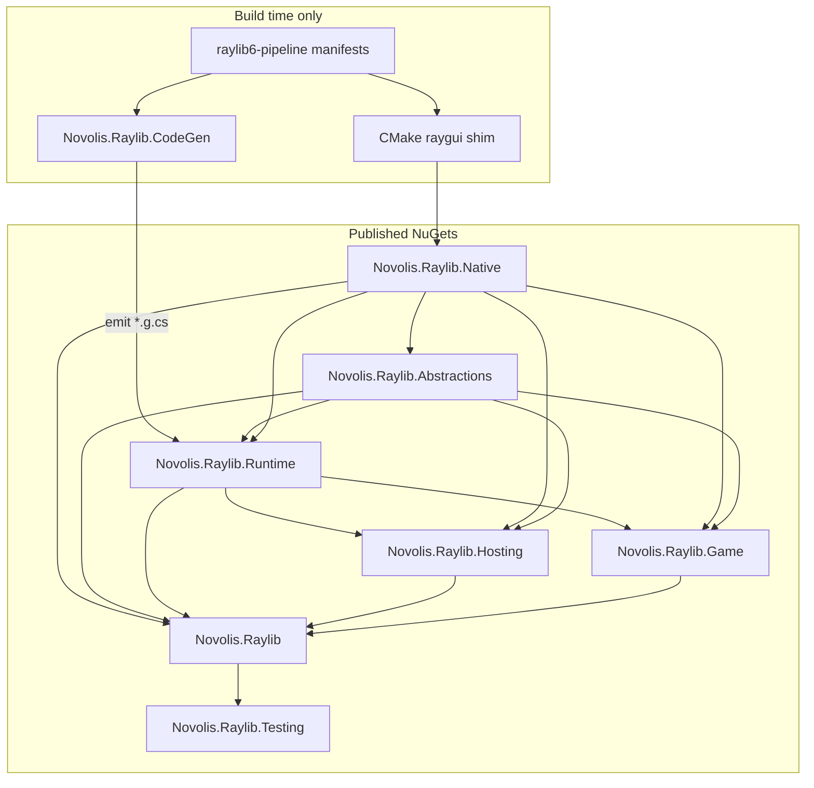
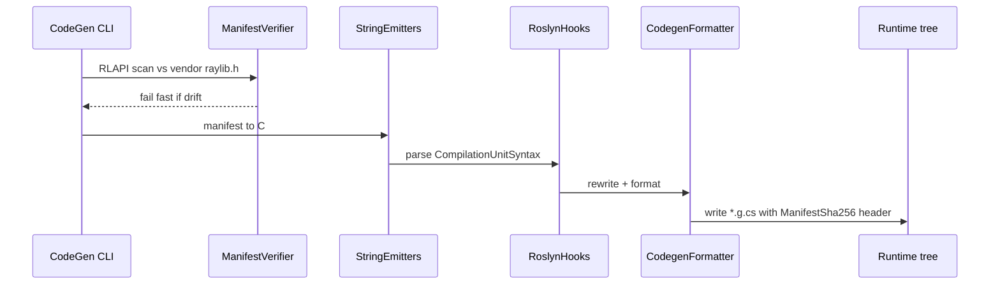
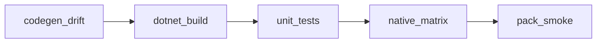

# Novolis Raylib — Full Library Build Plan

Implement the ecosystem defined in [raylib-ecosystem-specs.md](plans/raylib/raylib-ecosystem-specs.md) and [raylib-package-ecosystem.md](plans/raylib-package-ecosystem.md), using [StarConflictsRevolt/external](D:/github/StarConflictsRevolt/external) as the **proven reference implementation** for codegen, native packaging, and offscreen testing—not as the final package shape (that repo ships one `Novolis.Raylib`; this repo splits into the spec’s graph).

---

## North star

| Principle | Source |
|-----------|--------|
| One user install: `Novolis.Raylib` | Spec |
| Codegen at **library build only** → emits into **Runtime** | Spec |
| raylib + raygui always paired in **Native** | Spec |
| Manifest-first bindings + Roslyn hooks + SHA256 drift gates | StarConflictsRevolt |
| Testing is a **separate NuGet** depending **only** on aggregate | Spec |
| Consumers never run codegen | Spec |



---

## Phase 0 — Repository bootstrap

**Create:** `github.com/novolis/novolis-raylib` (name per org policy in [bootstrapping-organization.md](plans/bootstrapping-organization.md)).

**Solution layout** (mirror reference ergonomics, align to spec packages):

```text
novolis-raylib/
├── build/
│   ├── Directory.Build.props          # TFMs, nullable, analyzers, versioning
│   ├── Novolis.Raylib.Packaging.props
│   ├── Novolis.Raylib.CodeGen.targets # emit into Runtime, not aggregate
│   └── Novolis.Raylib.Native.targets
├── src/
│   ├── Novolis.Raylib.Native/
│   ├── Novolis.Raylib.Abstractions/
│   ├── Novolis.Raylib.Runtime/        # codegen output + hand-written runtime
│   ├── Novolis.Raylib.Hosting/
│   ├── Novolis.Raylib.Game/
│   ├── Novolis.Raylib/                # aggregate .csproj only
│   ├── Novolis.Raylib.Testing/
│   ├── Novolis.Raylib.CodeGen/
│   ├── Novolis.Raylib.CodeGen.Abstractions/
│   └── Novolis.Raylib.CodeGen.Hooks/
├── pipeline/raylib6/                  # renamed from external/raylib6-pipeline
│   ├── run.cs
│   ├── fetch-sources.cs
│   ├── versions.json
│   └── *.manifest.json
├── native/raylib6-with-raygui/        # port CMake + shim sources
├── vendor/                            # raylib.h, raygui.h, prebuilts (gitignored)
├── tests/
│   ├── Novolis.Raylib.CodeGen.Unit/
│   ├── Novolis.Raylib.Runtime.Unit/
│   ├── Novolis.Raylib.Hosting.Unit/
│   ├── Novolis.Raylib.Game.Unit/
│   └── Novolis.Raylib.Testing.Integration/
├── samples/
│   ├── HelloGame/                     # Game path
│   ├── HelloRuntime/                  # Runtime/shell path
│   └── HelloHosting/                  # IHost path
├── scripts/
│   ├── raylib-codegen-check.ps1
│   └── raylib-e2e.ps1
└── .github/workflows/ci.yml
```

**TFM:** `net10.0` (or org-standard LTS) for all product packages; `net10.0` executable for CodeGen CLI.

**Central package management:** `Directory.Packages.props` with pinned `Microsoft.CodeAnalysis.CSharp`, `TUnit`, `Microsoft.Extensions.Hosting`.

**Rename from reference:** drop `starconflicts_` / `STARCONFLICTS_` prefixes → `novolis_raygui` shim DLL and `NOVOLIS_RAYLIB_*` env vars.

---

## Phase 1 — Native foundation (`Novolis.Raylib.Native`)

**Port from:** `D:\github\StarConflictsRevolt\external\native\raylib6-with-raygui\` + `Novolis.Raylib.Native\`.

| Deliverable | Detail |
|-------------|--------|
| CMake shim | `raygui_shim.c` (`RAYGUI_IMPLEMENTATION`), `trace_shim.c`, links prebuilt raylib per RID |
| RID pack | `runtimes/win-x64/native/raylib.dll`, `novolis_raygui.dll`, linux/macOS analogs |
| MSBuild targets | `buildTransitive` copy to output; load order documented |
| Windows import lib | Port `generate-raylib-windows-def.cs` (PeNet → `.def` → `lib.exe`) when only DLL available |
| Vendor fetch | `pipeline/raylib6/fetch-sources.cs` + `versions.json` (raylib 6.x + raygui 4.x) |

**Rules (spec):** no generated C# in Native; no optional raygui-less build.

**CI job:** `native-build` on win/linux matrix; artifact natives into pack layout.

---

## Phase 2 — Advanced codegen stack (repo-only)

**Port projects** from `Novolis.Raylib.CodeGen*`, rewire `RepoPaths` to emit under `src/Novolis.Raylib.Runtime/`:

| Output path (Runtime) | Manifest | Emitter |
|----------------------|----------|---------|
| `Interop/Raylib6Native.g.cs` | `raylib-exports.manifest.json` | `RaylibInteropEmitter` |
| `Interop/RayguiShimExports.g.cs` | `raygui-exports.manifest.json` | `RayguiInteropEmitter` |
| `Interop/RaylibDebugFrameHooks.g.cs` | `raylib-debug.manifest.json` | `RaylibDebugHooksEmitter` |
| `Rendering/Graphics.g.cs`, etc. | `facades.manifest.json` | `FacadeEmitter` |

### 2a — Manifest system (authoritative API contract)

Copy and adapt the four JSON manifests from `external/raylib6-pipeline/`. Keep **schema v2** shape:

- `imports[]` with `name`, `template`, optional `description`
- `structs[]` for blittable interop types
- `interopPolicy`: `suppressGcTransitionByTemplate`, `neverSuppressGcTransition`, `facadeMethodImpl`, `useDisableRuntimeMarshalling`

**Templates** stay the curated vocabulary (`void_void`, `void_color`, `void_string_utf8_int_int_int_color`, `nint_image_string_utf8_out_int`, …)—do not auto-bind entire `raylib.h` for v1.

### 2b — Pipeline stages



**CLI commands** (port `Program.cs`):

| Command | Purpose |
|---------|---------|
| `generate` | Full emit (default maintainer path) |
| `verify` | Manifest ⊆ header, no write |
| `suggest-raylib` | Regex missing `RLAPI` names when upgrading raylib |
| `hooks list` | Discover `IRaylibCodegenHook` implementations |

### 2c — Roslyn hook extensibility

Port `Novolis.Raylib.CodeGen.Abstractions` + `Novolis.Raylib.CodeGen.Hooks`:

| Hook | Phase | Behavior |
|------|-------|----------|
| `AnnotateLibraryImportHook` | Interop | XML docs from manifest `description` |
| `InjectEndDrawingNotifyHook` | Facade | `Graphics.EndDrawing` notifies debug hooks |
| `FacadeInliningHook` | Facade | `[MethodImpl(AggressiveInlining)]` on forwards |

**Extension point:** new hooks ship in `CodeGen.Hooks` or separate `*.Hooks` plugin assemblies discovered by `HookDiscovery`.

### 2d — MSBuild integration

Adapt [Novolis.Raylib.CodeGen.targets](D:/github/StarConflictsRevolt/build/Novolis.Raylib.CodeGen.targets):

- Attach to **`Novolis.Raylib.Runtime.csproj`** (not aggregate)
- `BeforeTargets="CoreCompile"` with incremental `Inputs`/`Outputs`
- `RunRaylibCodegen=false` when `IsPacking=true` (committed `*.g.cs` is source of truth for pack)
- **Committed generated files** in git; CI regenerates and `git diff --exit-code`

### 2e — Codegen enhancements (beyond reference)

Add in v1 or v1.1 without breaking manifest schema:

| Enhancement | Benefit |
|-------------|---------|
| `emit-report.json` | Machine-readable diff: import count, template histogram, policy overrides |
| Facade namespace map in `facades.manifest.json` | Explicit `Novolis.Raylib.Rendering` vs folder convention |
| `verify --strict` | Fail if manifest symbols deprecated in header comments |
| Optional ClangSharp path | `pipeline/raylib6/generate-bindings.cs` behind `NOVOLIS_RAYLIB_RUN_CLANGSHARP=1` for **suggestions only**, not shipping emit |
| Source generator stub project | Future: analyzer package for compile-time manifest lint (not v1 blocker) |

**Open decision (resolve in Phase 2):** `Novolis.Raylib.Interop` types **`internal`** (reference default) vs **`public`** escape hatch—recommend **`public`** on `Raylib6Native` partial class with `[EditorBrowsable(Never)]` for advanced users per spec.

---

## Phase 3 — Abstractions + Runtime (managed core)

### 3a — `Novolis.Raylib.Abstractions`

Port contracts from reference:

```csharp
// Illustrative — port IRaylibFrameRenderer, IRaylibShellRuntime
public interface IRaylibFrameRenderer
{
    void OnFrame(float dt, int width, int height);
}
```

Add **hosting-oriented** contracts (new, spec-driven):

| Interface | Role |
|-----------|------|
| `IRaylibFrameRenderer` | Per-frame callback (existing) |
| `IRaylibShellRuntime` | Shell loop entry (existing) |
| `IStartupSystem` / `IFixedUpdateSystem` / `IUpdateSystem` / `IRenderSystem` / `IShutdownSystem` | Phased loops for Hosting |
| `IRaylibInvalidationSource` | EventLoop invalidation signal (optional v1) |

**Depends on:** Native only (no interop types in public contracts).

### 3b — `Novolis.Raylib.Runtime`

**Generated:** all `*.g.cs` under Interop + domain folders.

**Hand-written** (port + extend from reference `Novolis.Raylib/`):

| Area | Files / concepts |
|------|------------------|
| Shell | `RaylibRuntimeShell`, `RaylibWindowShellRuntime` implementing `IRaylibShellRuntime` |
| Raygui | `RayguiShimHost` — load `novolis_raygui`, bind function pointers |
| Types | `Color`, `Vector2`, `Rectangle` (hand-written ergonomics over interop structs) |
| Debug | `RaylibDebug` — env gates for tests |
| Logging | `Logger` / trace bridge from `trace_shim.c` |

**Project settings:** `DisableRuntimeMarshalling` when policy says so; `AllowUnsafeBlocks` for interop boundary only.

**Namespaces (spec):**

- `Novolis.Raylib.Interop` — generated
- `Novolis.Raylib.Rendering`, `.Windowing`, `.Interact`, `.Timing`, `.Audio` — façades
- `Novolis.Raylib.Shell` — default shell

**Completeness rule:** a hardcore dev can ship using **Runtime alone** (shell + façades + interop)—no Hosting/Game required.

---

## Phase 4 — Sugar layers

### 4a — `Novolis.Raylib.Game` (beginner / jam)

New code; reference has no equivalent.

| API | Implementation |
|-----|----------------|
| `RayGame.Run(title, w, h, Action<RayGameContext>)` | Wraps `RaylibRuntimeShell` + single draw delegate |
| `RayGameContext` | Thin wrapper over façades: `Clear`, `Text`, `Rect`, `Circle` |
| Optional `RayGame.RunAsync` | `Task` return for async-friendly tutorials |

**Depends on:** Runtime (+ transitive Abstractions, Native).

**Constraints:** no forced DI; single-file friendly; delegates to Runtime, never bypasses Native pairing.

### 4b — `Novolis.Raylib.Hosting` (enterprise)

| API | Implementation |
|-----|----------------|
| `RaylibHost.CreateApplicationBuilder(args)` | `HostApplicationBuilder` + raylib-specific `IServiceCollection` extensions |
| `AddRaylib()` / `AddRenderLoop()` / `AddEventLoop()` | Register shell, loop driver, options |
| `RaylibHostOptions` | Window size, title, target FPS, loop model |
| Loop drivers | **RenderLoop:** Input → FixedUpdate → Update → Render; **EventLoop:** Poll → Dispatch → RenderIfInvalidated |

Wire phased systems via `IHostedService` or custom `BackgroundService` that owns the raylib loop on the main thread (document: **raylib is main-thread**; no hidden threading).

**Logging:** `ILogger` bridge to existing trace shim.

**Depends on:** Runtime, Abstractions, Native (explicit Native ref: follow open decision—recommend **transitive only** via Runtime).

---

## Phase 5 — Aggregate + Testing

### 5a — `Novolis.Raylib` (aggregate)

Empty or minimal assembly:

```xml
<!-- ProjectReference all product packages; no codegen -->
<ProjectReference Include="..\Novolis.Raylib.Native\..." />
<ProjectReference Include="..\Novolis.Raylib.Abstractions\..." />
<ProjectReference Include="..\Novolis.Raylib.Runtime\..." />
<ProjectReference Include="..\Novolis.Raylib.Hosting\..." />
<ProjectReference Include="..\Novolis.Raylib.Game\..." />
```

Unified versioning via `MinVer` or `Nerdbank.GitVersioning`.

### 5b — `Novolis.Raylib.Testing` (awesome testing tools)

**Depends only on** `Novolis.Raylib` (spec). Port reference harness, then **extend**:

#### Core (port from reference)

| Type | Purpose |
|------|---------|
| `RaylibOffscreenTestHarness` | Hidden window, bounded frames, optional PNG |
| `DelegateRaylibFrameRenderer` | `Action<float,int,int>` adapter |
| `RaylibOffscreenTestOptions` / `RaylibOffscreenTestRunResult` | Skipped / Passed / Failed semantics |
| Env gates | `NOVOLIS_RAYLIB_OFFSCREEN_TESTS`, `NOVOLIS_RAYLIB_NATIVE_TESTS` |

#### Enhancements (new)

| Feature | Description |
|---------|-------------|
| `DeterministicFrameClock` | Manual `Step(delta)` for unit tests without real time |
| `SimulatedInput` | Queue key/mouse events consumed by test frame renderer or Hosting test host |
| `RaylibTestSession` | `using` scope: init audio/window once, run N scenarios, guaranteed teardown |
| `FramebufferAssert` | PNG byte[] or hash comparison; **optional** `Verify.Image` / custom golden path under `tests/_golden/` (opt-in, not default CI) |
| `RaylibHostingTestHost` | Build `IHost` in memory, step render phases without real window when possible |
| TUnit adapters | `[Condition("NOVOLIS_RAYLIB_NATIVE_TESTS")]` helpers, `Assert.Skip()` wrappers matching harness `Skipped` results |
| CI attribute | `[RunOnlyIfNativeRaylib]` metadata for test discovery docs |

**CI default:** codegen + reflection tests run **without** natives; native/offscreen jobs are matrix legs with env vars set.

---

## Phase 6 — Test projects (quality gates)

### 6a — `Novolis.Raylib.CodeGen.Unit`

Port patterns from `StarConflictsRevolt.Tests.Bindings.Raylib6.Unit`:

| Test class | Asserts |
|------------|---------|
| `RaylibCodegenPipelineTests` | Regenerate in temp dir; `ManifestSha256` matches manifest bytes |
| `RaylibInteropReflectionTests` | `imports.Count == Raylib6Native` `[LibraryImport]` count |
| `RaylibInteropOptimizationTests` | `SuppressGCTransition` / `DisableRuntimeMarshalling` per policy |
| `RaylibManifestVerifierTests` | Negative cases: missing RLAPI |
| `FacadeEmitterTests` | Known façade forwards to interop names |

**Runner:** TUnit, `OutputType=Exe`, `--maximum-parallel-tests 1` for native legs.

### 6b — `Novolis.Raylib.Runtime.Unit`

Shell smoke (mocked where possible), façade behavior, `RayguiShimHost` load skip when no native.

### 6c — `Novolis.Raylib.Testing.Integration`

Offscreen harness draws known scene → PNG hash or pixel sample; Hosting loop stepping; Game `RayGame.Run` smoke (native job only).

### 6d — No golden files in default CI

Follow reference: **SHA256 in generated files + git diff**, not committed PNG goldens. Goldens optional for local `raylib-e2e.ps1`.

---

## Phase 7 — CI/CD and publishing

**Workflow** (adapt `StarConflictsRevolt/.github/workflows/ci.yml`):



| Job | Steps |
|-----|-------|
| `codegen-drift` | `dotnet run pipeline/raylib6/run.cs generate` → `git diff --exit-code src/Novolis.Raylib.Runtime` |
| `build` | `dotnet build` solution |
| `test-unit` | All tests **without** native env |
| `test-native` | `windows-latest` + optional `ubuntu-latest`; env `NOVOLIS_RAYLIB_*=1`; `scripts/raylib-e2e.ps1` |
| `pack-smoke` | `dotnet pack` all 7 NuGet IDs; assert nupkg contains natives |

**Publish:** GitHub Packages + nuget.org per org release policy; aligned semver across all packages.

**Scripts:**

- `scripts/raylib-codegen-check.ps1` — local pre-push
- `pipeline/raylib6/run.cs all` — fetch + native + generate for new machine bootstrap

---

## Phase 8 — Samples and documentation

| Sample | Demonstrates |
|--------|--------------|
| `samples/HelloGame` | `dotnet add Novolis.Raylib` + `RayGame.Run` |
| `samples/HelloRuntime` | `IRaylibFrameRenderer` + `RaylibRuntimeShell` |
| `samples/HelloHosting` | `RaylibHost.CreateApplicationBuilder` + `IRenderSystem` |
| `samples/HelloTesting` | Test project with `Novolis.Raylib.Testing` |

**Docs in repo:** `README.md` (install one line), `docs/codegen.md`, `docs/testing.md`, `docs/architecture.md` linking to `.github` specs.

**Quickstarts must only show** `Novolis.Raylib` install (spec forbidden: direct Native/Runtime in beginner docs).

---

## Migration map: reference → spec repo

| StarConflictsRevolt | novolis-raylib |
|---------------------|----------------|
| `external/Novolis.Raylib/` interop + façades + shell | Split: generated → **Runtime**; contracts → **Abstractions** |
| `external/Novolis.Raylib.Abstractions/` | **Abstractions** (unchanged role) |
| `external/Novolis.Raylib.Native/` | **Native** (rename shim DLL) |
| `external/Novolis.Raylib.Testing/` | **Testing** (enhanced) |
| `external/Novolis.Raylib.CodeGen*` | **CodeGen*** (emit path → Runtime) |
| `external/raylib6-pipeline/` | `pipeline/raylib6/` |
| `build/Novolis.Raylib.CodeGen.targets` | Target **Runtime** csproj |
| `STARCONFLICTS_RAYLIB_*` env | `NOVOLIS_RAYLIB_*` |
| Single public package | **Aggregate** + Game + Hosting |

**Not ported:** `Novolis.Physics.*` (orthogonal).

---

## Implementation order (recommended sprints)

| Sprint | Outcome | Exit criteria |
|--------|---------|---------------|
| **S1** | Repo skeleton, Native pack, fetch script | Sample app loads `raylib.dll` on win-x64 |
| **S2** | CodeGen port, committed `*.g.cs`, drift CI | `verify` + `generate` green; reflection tests pass |
| **S3** | Runtime shell, raygui bind, façades usable | `HelloRuntime` draws text |
| **S4** | Abstractions stable, Game API | `HelloGame` in &lt;20 lines |
| **S5** | Hosting + phased systems | `HelloHosting` with DI |
| **S6** | Aggregate pack, Testing harness + unit/integration tests | `dotnet pack` produces 7 packages |
| **S7** | Samples, docs, nuget publish dry-run | Org profile links to package |

---

## Resolved / deferred decisions

| Decision | Recommendation |
|----------|----------------|
| Interop visibility | `public` in `Novolis.Raylib.Interop` with editor-browsable hiding |
| Hosting/Game explicit Native ref | Transitive via Runtime only |
| TUnit in Testing | Optional helper package surface inside **Testing**; core APIs runner-agnostic |
| ClangSharp | Dev-only suggest path, not shipping |
| Golden PNG tests | Opt-in local/E2E only |

---

## Risk register

| Risk | Mitigation |
|------|------------|
| GLFW/GLFW headless CI flakiness | Serial tests; skip by default; hidden window flag |
| raylib major bump | `suggest-raylib` + manifest verifier + vendor pin in `versions.json` |
| Main-thread vs `IHost` threading | Document single-thread loop; Hosting runs raylib on host's main thread |
| Package proliferation | Aggregate ensures one-line install; shared versioning |

---

## Success criteria

1. `dotnet add package Novolis.Raylib` → beginner, hardcore, and enterprise paths work without extra NuGets.
2. Maintainers run `pipeline/raylib6/run.cs all`; CI catches codegen drift.
3. Test authors add `Novolis.Raylib.Testing` and get deterministic stepping, offscreen harness, env-gated native CI legs.
4. Advanced users reach `Novolis.Raylib.Interop` without forking the stack.
5. raylib + raygui natives always ship together from **Native**.
