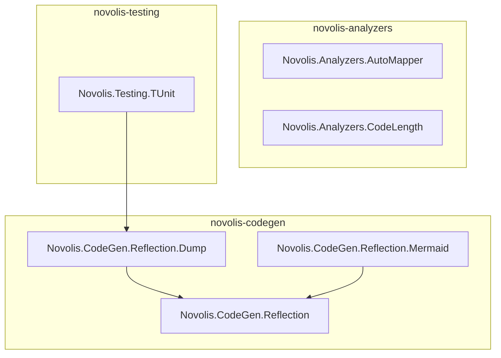

# Wave 5: P1 codegen + analyzers extraction

You chose **Wave 5 (P1 code) now**, skipping P0 NuGet publish/registry close-out in this effort. P0 repos remain the pattern to copy; operational shipping can follow later.

## Scope (locked from [frank-p1-spikes.md](D:/novolis/novolis-governance/docs/frank-p1-spikes.md))

| Target repo | In scope (Frank) | Out of scope |
|-------------|------------------|--------------|
| [novolis-codegen](D:/novolis/novolis-codegen) | `Frank.Reflection`, `Frank.Reflection.Dump`, `Frank.Reflection.Mermaid` | Roslyn, RoslynQuoter, `Frank.BuildTasks.MarkdownDocGenerator` |
| [novolis-analyzers](D:/novolis/novolis-analyzers) | `Frank.Analyzers.AutoMapper`, `Frank.Analyzers.CodeLength` | CppInteropts, BlankAnalyzer, XUnit/Localization generators, `AdditionalFiles`, `Refactoring.AutoProperties` |

**Note:** Frank’s Mermaid package is **not WPF** — it emits Mermaid `classDiagram` text via reflection helpers ([ClassDiagramBuilder.cs](D:/novolis/bootstrap/scratch/frank-eval/Frank.Reflection/Frank.Reflection.Mermaid/ClassDiagramBuilder.cs)). Frank marked it `IsPackable=false`; Novolis should pack it as `0.1.0-preview.1`.

## Package IDs and layout

Replace scaffold placeholders (`Novolis.CodeGen`, `Novolis.Analyzers` single-package stubs in [.novolis/packages.json](D:/novolis/novolis-codegen/.novolis/packages.json)) with multi-facet layout matching P0:

```text
novolis-codegen/
  src/Novolis.CodeGen.Reflection/
  src/Novolis.CodeGen.Reflection.Dump/     → ProjectReference → Reflection
  src/Novolis.CodeGen.Reflection.Mermaid/  → ProjectReference → Reflection
  tests/Novolis.CodeGen.Reflection.Tests/
  tests/Novolis.CodeGen.Reflection.Dump.Tests/
  tests/Novolis.CodeGen.Reflection.Mermaid.Tests/   (or single combined test project)
  Novolis.CodeGen.slnx

novolis-analyzers/
  src/Novolis.Analyzers.AutoMapper/
  src/Novolis.Analyzers.CodeLength/
  tests/Novolis.Analyzers.Tests/           (shared harness + per-analyzer tests)
  Novolis.Analyzers.slnx
```

| Frank | Novolis `PackageId` | Namespace |
|-------|---------------------|-----------|
| `Frank.Reflection` | `Novolis.CodeGen.Reflection` | `Novolis.CodeGen.Reflection` |
| `Frank.Reflection.Dump` | `Novolis.CodeGen.Reflection.Dump` | `Novolis.CodeGen.Reflection.Dump` |
| `Frank.Reflection.Mermaid` | `Novolis.CodeGen.Reflection.Mermaid` | `Novolis.CodeGen.Reflection.Mermaid` |
| `Frank.Analyzers.AutoMapper` | `Novolis.Analyzers.AutoMapper` | `Novolis.Analyzers.AutoMapper` |
| `Frank.Analyzers.CodeLength` | `Novolis.Analyzers.CodeLength` | `Novolis.Analyzers.CodeLength` |

Append these rows to [frank-naming-and-structure.md](D:/novolis/novolis-governance/docs/frank-naming-and-structure.md) (namespace replacement table + `.novolis/packages.json` examples).

## Architecture



## Execution steps

### 1. Governance briefs (before code)

Create two briefs mirroring [wave-1-testing.md](D:/novolis/novolis-governance/docs/extraction-briefs/wave-1-testing.md):

- `docs/extraction-briefs/wave-5-codegen.md` — sources, deps (Humanizer, VarDump, CodeAnalysis.CSharp for Dump), test files to port (`TypeExtensionsTests`, `DumpExtensionsTests`), Roslyn/doc tests explicitly out
- `docs/extraction-briefs/wave-5-analyzers.md` — analyzer packaging rules, `OutputItemType=Analyzer` consumer pattern, AutoMapper skip notes from Frank, new minimal CodeLength tests (Frank had **no** CodeLength unit tests)

Update [roadmap.md](D:/novolis/novolis-governance/docs/roadmap.md) wave 5 row to “in progress” when execution starts.

### 2. Extend migration tooling

Add longest-match-first replacements to [migrate-frank-slice.ps1](D:/novolis/novolis-governance/scripts/migrate-frank-slice.ps1):

- `Frank.Reflection.Mermaid` → `Novolis.CodeGen.Reflection.Mermaid`
- `Frank.Reflection.Dump` → `Novolis.CodeGen.Reflection.Dump`
- `Frank.Reflection` → `Novolis.CodeGen.Reflection`
- `Frank.Analyzers.AutoMapper` → `Novolis.Analyzers.AutoMapper`
- `Frank.Analyzers.CodeLength` → `Novolis.Analyzers.CodeLength`

Run per project (same pattern as P0), e.g.:

```powershell
.\migrate-frank-slice.ps1 -FrankRoot "...\Frank.Reflection\Frank.Reflection" `
  -DestProject "D:\novolis\novolis-codegen\src\Novolis.CodeGen.Reflection" `
  -FrankTestsRoot "...\Frank.Reflection.Tests\Reflection" `
  -DestTests "D:\novolis\novolis-codegen\tests\Novolis.CodeGen.Reflection.Tests"
```

Repeat for Dump, Mermaid, both analyzers (tests: copy only `Analyzers/AutomapperAnalyzerTests.cs` + shared `TestingInfrastructure` needed by that test).

### 3. Scaffold `novolis-codegen`

- Create `src/` / `tests/` csproj files (copy structure from [novolis-security](D:/novolis/novolis-security))
- [Directory.Packages.props](D:/novolis/novolis-codegen/Directory.Packages.props): **replace xUnit with TUnit `0.25.21`**; add `Humanizer.Core`, `VarDump`, `Microsoft.CodeAnalysis.CSharp` (align with [novolis-testing](D:/novolis/novolis-testing/Directory.Packages.props) — `4.14.0`)
- Dump package: central versions only (no `Version=` on `PackageReference`)
- Mermaid: set `IsPackable=true`, `PackageId`, `0.1.0-preview.1`
- `Novolis.CodeGen.slnx` listing all src + test projects
- Update `.novolis/packages.json` with one entry per packable facet

### 4. Scaffold `novolis-analyzers`

- Analyzer csproj pattern from Frank (pack DLL to `analyzers/dotnet/cs`; retain `tools/install.ps1` if still required)
- AutoMapper: `Microsoft.CodeAnalysis.CSharp.Workspaces`; set `IsRoslynComponent` / `EnforceExtendedAnalyzerRules` as Frank did
- CodeLength: `Microsoft.CodeAnalysis.Analyzers` + `Microsoft.CodeAnalysis.CSharp`
- Central package versions in `Directory.Packages.props` (TUnit + Roslyn testing packages **without** xUnit — see step 5)
- `Novolis.Analyzers.slnx` + multi-entry `.novolis/packages.json`

### 5. Tests: TUnit only

| Area | Action |
|------|--------|
| CodeGen | Port `TypeExtensionsTests`, `DumpExtensionsTests` from xUnit `[Fact]` to TUnit `[Test]`; use `await Assert.That(...)` / FluentAssertions as in P0 |
| CodeGen | Skip `RoslynSyntaxTreeFactoryTests`, `MarkdownDocumentationGeneratorTests`, `SolutionAnalyzerTests`, `TaskTest` |
| Analyzers | Port `AutomapperAnalyzerTests` + minimal `TestingInfrastructure` (mark existing skips with TUnit skip attribute if harness still broken on net10) |
| Analyzers | Add **new** TUnit smoke tests for CodeLength (compile snippet with analyzer reference; assert diagnostic ID) — Frank never had these |
| Analyzer harness | Replace `Microsoft.CodeAnalysis.*.Testing.XUnit` with base `Microsoft.CodeAnalysis.CSharp.Analyzer.Testing` / code-fix testing packages; wire output via TUnit `TestContext` instead of `ITestOutputHelper` |

**Do not** add xUnit to Novolis repos.

### 6. Deduplicate `Novolis.Testing.TUnit`

Today dump logic is **copied** under [novolis-testing/src/Novolis.Testing.TUnit/Dump/](D:/novolis/novolis-testing/src/Novolis.Testing.TUnit/Dump/) and used by [TestOutputCSharpExtensions.cs](D:/novolis/novolis-testing/src/Novolis.Testing.TUnit/TestOutputCSharpExtensions.cs).

After CodeGen migration:

1. Delete `Novolis.Testing.TUnit/Dump/` folder
2. Add `ProjectReference` to `..\..\novolis-codegen\src\Novolis.CodeGen.Reflection.Dump\...`
3. Change usings from `Novolis.Testing.TUnit.Dump` → `Novolis.CodeGen.Reflection.Dump`
4. Rebuild `novolis-testing` + `novolis-codegen`

Update [frank-naming-and-structure.md](D:/novolis/novolis-governance/docs/frank-naming-and-structure.md) dependency table: replace “inline dump in TUnit” with `Novolis.CodeGen.Reflection.Dump` package reference (local path until NuGet publish).

### 7. Verify

```powershell
dotnet build D:\novolis\novolis-codegen\Novolis.CodeGen.slnx
dotnet build D:\novolis\novolis-analyzers\Novolis.Analyzers.slnx
dotnet test D:\novolis\novolis-codegen\Novolis.CodeGen.slnx
dotnet test D:\novolis\novolis-analyzers\Novolis.Analyzers.slnx
dotnet build D:\novolis\novolis-testing\Novolis.Testing.slnx
```

Fix analyzer diagnostic IDs if Frank used `FRANK####` prefixes — rename to `NOVL####` or keep stable IDs per brief decision (document in wave-5-analyzers brief).

### 8. Sunset + registry (lightweight, no NuGet gate)

- Add rows to [frank-sunset-banners.md](D:/novolis/novolis-governance/docs/frank-sunset-banners.md) for `Frank.Reflection` and `Frank.Analyzers`
- Optional: stub [novolis-registry/packages/](D:/novolis/novolis-registry/packages/) JSON for the five new package IDs (no publish required in this wave)

**Explicitly deferred** (per your scope choice): trusted publishing, P0 registry completion, Frank P0 archive, git push/CI.

## Risks and mitigations

| Risk | Mitigation |
|------|------------|
| AutoMapper analyzer tests already skipped on Frank net10/Roslyn | Keep skips; ensure solution builds; add CodeLength smoke test for real coverage |
| Duplicate dump drift between TUnit and CodeGen | Step 6 is mandatory in this wave |
| Cross-repo `ProjectReference` breaks CI | Same as P0: document local `D:\novolis\` layout; CI multi-checkout or wait for NuGet |
| Analyzer package versioning vs CodeAnalysis 4.10 vs 4.14 | Bump Frank analyzer deps to central `4.14.0` during scaffold |

## Success criteria

- Both solutions build with 0 errors on `net10.0`
- CodeGen tests pass for Reflection + Dump; Mermaid has at least one TUnit test (build diagram string)
- Analyzers solution builds; CodeLength has a passing TUnit test; AutoMapper may remain skipped but compiles
- `Novolis.Testing.TUnit` no longer contains duplicated Dump sources; depends on `Novolis.CodeGen.Reflection.Dump`
- Governance briefs + naming doc updated; no `Frank.*` in production Novolis code
