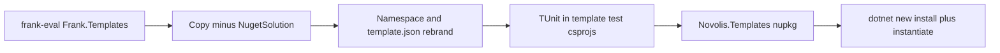

# Wave 6: Frank.Templates → novolis-templates

Wave 5 is complete per [roadmap.md](D:/novolis/novolis-governance/docs/roadmap.md). This plan covers the next **code** migration you selected: **Wave 6 (templates merge)**.

## Scope

| In scope | Out of scope |
|----------|----------------|
| 7 Frank template packs (see below) | `Frank.Templates.NugetSolution` — duplicates [novolis-template-dotnet](https://github.com/Novolis-Platform/novolis-template-dotnet) per [frank-p1-spikes.md](D:/novolis/novolis-governance/docs/frank-p1-spikes.md) |
| Single umbrella package `Novolis.Templates` (`PackageType=Template`) | NuGet publish / trusted publishing (deferred like Wave 5) |
| Rebrand `Frank.Templates.*` → `Novolis.Templates.*` | Splitting into 7 separate NuGet packages (Frank used one meta pack) |
| TUnit in template **test** projects ([naming.md](D:/novolis/novolis-governance/docs/naming.md)) | CronJobs, Markdown, Networking, Collections |

**Template packs to migrate** (from [Frank.Templates.csproj](D:/novolis/bootstrap/scratch/frank-eval/Frank.Templates/Frank.Templates/Frank.Templates.csproj)):

1. `Frank.Templates.GitHubSolution`
2. `Frank.Templates.Microservice`
3. `Frank.Templates.MonoGame`
4. `Frank.Templates.NoXaml.App`
5. `Frank.Templates.NoXaml.Solution`
6. `Frank.Templates.SemanticKernel`
7. `Frank.Templates.TestContainerTemplate` (identity `Testcontainers.Module.CSharp`; keep `sourceName` `ModuleName`)

**Exclude:** `Frank.Templates.NugetSolution` (only pack with `Frank.Testing.*` package refs).

## Target layout

Align with Novolis `src/` convention; keep Frank’s “content pack” model:

```text
novolis-templates/
  src/Novolis.Templates/
    Novolis.Templates.csproj          # PackageType=Template, IncludeBuildOutput=false
    content/
      Novolis.Templates.Microservice/
      Novolis.Templates.MonoGame/
      ... (7 folders, each with .template.config/template.json)
  tests/Novolis.Templates.SmokeTests/ # optional but recommended
  Novolis.Templates.slnx            # pack project + smoke tests only
  .novolis/packages.json              # update entry for Novolis.Templates
```



## Governance (before code)

1. Add [wave-6-templates.md](D:/novolis/novolis-governance/docs/extraction-briefs/wave-6-templates.md):
   - Merge policy vs `novolis-template-dotnet` (library/solution scaffold only; no overlap with NugetSolution)
   - Short-name table (`frankmicroservice` → `novolismicroservice`, etc.)
   - TUnit migration rules for in-template tests
2. Extend [frank-naming-and-structure.md](D:/novolis/novolis-governance/docs/frank-naming-and-structure.md):
   - Row: `Frank.Templates` → `Novolis.Templates` in `novolis-templates`
   - `.novolis/packages.json` example for template repo
3. Extend [migrate-frank-slice.ps1](D:/novolis/novolis-governance/scripts/migrate-frank-slice.ps1) replacements (longest first):
   - `Frank.Templates.Microservice` → `Novolis.Templates.Microservice` (and siblings)
   - `Frank.Templates` → `Novolis.Templates`
4. Update [roadmap.md](D:/novolis/novolis-governance/docs/roadmap.md) wave 6 row and [frank-inventory.md](D:/novolis/novolis-governance/docs/frank-inventory.md) brief link.

## Implementation steps

### 1. Scaffold [novolis-templates](D:/novolis/novolis-templates)

- Create `src/Novolis.Templates/Novolis.Templates.csproj` modeled on Frank’s template project:
  - `PackageId` `Novolis.Templates`, `Version` `0.1.0-preview.1`
  - `PackageType=Template`, `IncludeContentInPack`, `ContentTargetFolders=content`
  - Novolis metadata from [package-policy.md](D:/novolis/novolis-governance/docs/package-policy.md) and [Directory.Build.props](D:/novolis/novolis-templates/Directory.Build.props)
  - `Content Include="content/**"` with excludes for `bin/`, `obj/`, `artifacts/`
- Add `Novolis.Templates.slnx` (pack + smoke test project).
- Update [.novolis/packages.json](D:/novolis/novolis-templates/.novolis/packages.json) paths to `src/Novolis.Templates/**`.
- `Directory.Packages.props`: TUnit `0.25.21` for smoke tests only (no xUnit).

### 2. Copy and rebrand template content

For each of the 7 packs under `D:\novolis\bootstrap\scratch\frank-eval\Frank.Templates\`:

```powershell
# Example: run migrate-frank-slice per template folder into content/
.\migrate-frank-slice.ps1 `
  -FrankRoot "...\Frank.Templates.Microservice" `
  -DestProject "D:\novolis\novolis-templates\src\Novolis.Templates\content\Novolis.Templates.Microservice"
```

- Rename top-level folders to `Novolis.Templates.*`.
- Edit each `.template.config/template.json`:
  - `author`: Novolis
  - `identity`, `name`, `shortName`, `sourceName`: Novolis equivalents
  - Preserve `Testcontainers.Module.CSharp` semantics for testcontainers template (only rebrand paths/author unless product wants new shortName)
- Strip `bin/`, `obj/`, `artifacts/` from copied trees.

### 3. TUnit inside template test projects

Frank test csprojs using xUnit (migrate to TUnit, no xUnit):

| Template | Test project |
|----------|----------------|
| Microservice | `Novolis.Templates.Microservice.Tests` |
| MonoGame | `Novolis.Templates.MonoGame.Tests` |
| NoXaml.Solution | `Novolis.Templates.NoXaml.Solution.Tests` |

- Replace `xunit` / `Divergic.Logging.Xunit` with `TUnit` + `FluentAssertions` (central versions).
- Convert `[Fact]` → `[Test]`; remove `ITestOutputHelper` where present.
- Do **not** add `Frank.Testing.*` or `Novolis.Testing.*` package refs to generated starter code unless a template explicitly needs them (none today except dropped NugetSolution).

### 4. Pack project wiring

- Add `README.md` + icon under `src/Novolis.Templates/` (adapt from Frank README with Novolis install commands).
- Ensure `.csproj` lists all 7 content roots (mirror Frank `Content Include` list, minus NugetSolution).

### 5. Smoke validation

Add `tests/Novolis.Templates.SmokeTests` (TUnit) or a small script invoked in CI:

```powershell
dotnet pack D:\novolis\novolis-templates\src\Novolis.Templates\Novolis.Templates.csproj -c Release -o .\artifacts
dotnet new install .\artifacts\Novolis.Templates.*.nupkg
dotnet new novolismicroservice -n SmokeMicroservice -o $env:TEMP\SmokeMicroservice
dotnet build $env:TEMP\SmokeMicroservice\*.sln
dotnet new uninstall Novolis.Templates
```

- Minimum: **Microservice** + **Testcontainers** template instantiate and build.
- Extend [ci.yml](D:/novolis/novolis-templates/.github/workflows/ci.yml) with a `template-smoke` job if `novolis-workflows` reusable workflow cannot pack/install templates (otherwise document local-only until workflow updated).

### 6. Sunset + registry (lightweight)

- [frank-sunset-banners.md](D:/novolis/novolis-governance/docs/frank-sunset-banners.md): row for `Frank.Templates` → `Novolis.Templates`
- [novolis-registry/packages/](D:/novolis/novolis-registry/packages/): stub `novolis-templates.json`

## Risks and mitigations

| Risk | Mitigation |
|------|------------|
| `sourceName` rename breaks template symbols | Keep `sourceName` aligned with folder names; run `dotnet new` smoke per template |
| WPF/MonoGame templates need Windows SDK in CI | Build smoke on Windows agent or skip MonoGame/NoXaml in Linux CI with documented local verify |
| Overlap with `novolis-template-dotnet` | Document in wave-6 brief; exclude NugetSolution |
| Large copy with stale `artifacts/` | Exclude in copy script / `.gitignore` |

## Success criteria

- `dotnet pack` produces `Novolis.Templates` `0.1.0-preview.1` with 7 templates
- `dotnet new install` + at least two templates instantiate and `dotnet build` on `net10.0`
- No `Frank.*` in packed template content (namespaces, package IDs, template.json)
- No xUnit in migrated template test projects
- Governance brief + naming doc + roadmap updated

## Deferred (explicit)

- NuGet trusted publishing for `novolis-templates`
- P0 registry completion for messaging/testing/transports/storage/security
- Frank source README banner on `Frank.Templates` repo
